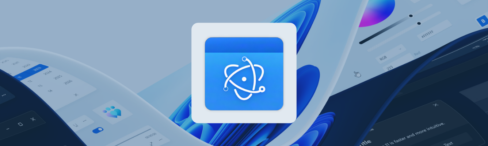
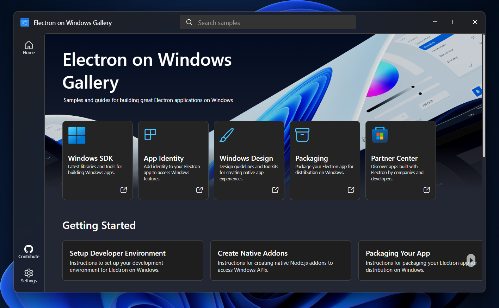

<p align="center">
  
</p>

<h1 align="center">
  <span>Electron on Windows Gallery</span>
</h1>
<h3 align="center">
  <span>Samples and guides for building great Electron applications on Windows</span>
</h3>

> [!IMPORTANT]
> :warning: **Status: Public Preview** - Electron on Windows Gallery is in public preview and in active development. It is not yet publishes to the Microsoft Store. We'd love your feedback! Share your thoughts by creating an [issue](https://github.com/microsoft/electron-on-windows-gallery/issues).

Electron on Windows Gallery is an Electron application which displays the range of native Windows functionality which can be accessed from Electron applications. It includes:
- Interactive samples powered by local AI models and the Windows SDK
- JavaScript sample code and API documentation
- Guides on getting started with Electron on Windows, building native addons, and more

<p align="center">
  
</p>

## Prerequisites

Before you get started, ensure you have the following installed:

- **[Node.js](https://nodejs.org/)** - Required for npm package management
- **[Git](https://git-scm.com/)** - Required to clone the repository
- **[Visual Studio Build Tools](https://visualstudio.microsoft.com/downloads/)** - Required for building native modules
- **[Python](https://www.python.org/)** - Required as a build dependency

You should also verify that your machine meets:
- [Electron's system prerequisites](https://www.electronjs.org/docs/latest/tutorial/tutorial-prerequisites)
- [Windows AI APIs system requirements](https://learn.microsoft.com/windows/ai/apis/get-started?tabs=winget%2Cwinui%2Cwinui2#dependencies)

## Contributing

This project welcomes contributions and suggestions. Most contributions require you to agree to a
Contributor License Agreement (CLA) declaring that you have the right to, and actually do, grant us
the rights to use your contribution. For details, visit [Contributor License Agreements](https://cla.opensource.microsoft.com).

When you submit a pull request, a CLA bot will automatically determine whether you need to provide
a CLA and decorate the PR appropriately (e.g., status check, comment). Simply follow the instructions
provided by the bot. You will only need to do this once across all repos using our CLA.

This project has adopted the [Microsoft Open Source Code of Conduct](https://opensource.microsoft.com/codeofconduct/).
For more information see the [Code of Conduct FAQ](https://opensource.microsoft.com/codeofconduct/faq/) or
contact [opencode@microsoft.com](mailto:opencode@microsoft.com) with any additional questions or comments.

## Getting started

### 1. Set up the environment

1. If you're new to building Electron apps, make sure your machine meets Electron's [system prerequisites](https://www.electronjs.org/docs/latest/tutorial/tutorial-prerequisites).
1. If you're new to running Windows AI API's, make sure your machine meet the [system requirements for Windows AI API's](https://learn.microsoft.com/windows/ai/apis/get-started?tabs=winget%2Cwinui%2Cwinui2#dependencies).

> [!IMPORTANT]
> Verify your device is able to access Windows AI models by downloading the [AI Dev Gallery app](https://apps.microsoft.com/detail/9n9pn1mm3bd5). Navigate to the "AI APIs" samples and ensure they can run on your device. If the samples are blocked, the AI models may be missing from your machine. You can manually request a download by selecting the "Request Model" button and following the directions within Windows Update settings.

### 2. Clone the repository

```shell
git clone https://github.com/microsoft/electron-on-windows-gallery.git
```

### 3. Configure local development

Before building the app locally, you'll need to create a `.env` file for Windows AI Limited Access Features:

```shell
# Create a .env file in the root of the repository with your LAF token
LAF_TOKEN=your_laf_token_here
```
> [!NOTE]
> The LAF token is required to unlock Windows AI Language Model features (used in Text Generation example). See [LAF Access Token Request](https://forms.office.com/pages/responsepage.aspx?id=v4j5cvGGr0GRqy180BHbR25txIwisw1PlceTVpYHUm9UODlVMkszVTFaRlVLVlBPNkNaV0hKMzM5Mi4u&route=shorturl) to request a token. 

### 4. Build and Run

```shell
cd \<path to electron-on-windows-gallery repo\>
npm install
npx winapp restore
npx winapp cert generate
npm run build-all
npm run setup-debug
npm run start
```

You should see a `.winapp` directory at the root of your repo.

## Windows AI API Bindings

This project uses [dynwinrt](https://github.com/lei9444/dynwinrt) to dynamically call Windows Runtime AI APIs from JavaScript. The `generated-js/` directory contains auto-generated CommonJS bindings produced by the `winrt-meta` CLI tool.

### SDK Versions

| Package | Version | Notes |
|---------|---------|-------|
| Microsoft.WindowsAppSDK | 1.8.251106002 | Main SDK (configured in `winapp.yaml`) |
| Microsoft.WindowsAppSDK.AI | 1.8.39 | AI APIs metadata (in `~/.winapp/packages` global cache) |
| dynwinrt-js | 0.1.3 | Runtime WinRT invocation layer ([npm](https://www.npmjs.com/package/dynwinrt-js)) |
| winrt-meta | 0.1.3 | Code generator CLI ([npm](https://www.npmjs.com/package/winrt-meta)) |

### AI Features

| Feature | Class | Description |
|---------|-------|-------------|
| Text Generation | `LanguageModel` | On-device text generation via Phi Silica |
| Text Summarization | `TextSummarizer` | Summarize text and conversations |
| Text Rewriting | `TextRewriter` | Rewrite text in different tones |
| Text to Table | `TextToTableConverter` | Convert unstructured text to table format |
| Image Description | `ImageDescriptionGenerator` | Generate captions for images |
| OCR | `TextRecognizer` | Optical character recognition |
| Image Scaling | `ImageScaler` | AI super-resolution image upscaling |
| Object Extraction | `ImageObjectExtractor` | Segment and extract objects from images |
| Object Removal | `ImageObjectRemover` | Erase objects and fill background |

### Regenerating Bindings

The `generated-js/` directory is produced by `winrt-meta` (installed as a devDependency). To regenerate after upgrading the SDK or the tool:

**1. Generate AI + ML bindings together:**

```shell
npx winrt-meta generate --lang js \
  --folder "<WINAPP_PACKAGES>/Microsoft.WindowsAppSDK.AI.1.8.39/metadata" \
  --output ./generated-js
```

Where `<WINAPP_PACKAGES>` is `~/.winapp/packages` (global cache populated by `npx winapp restore`).

**2. Generate Windows SDK system types** (StorageFile, BitmapDecoder, etc.):

```shell
# These are auto-detected from the installed Windows SDK
npx winrt-meta generate --lang js --namespace Windows.ApplicationModel --class-name LimitedAccessFeatures --output ./generated-js
npx winrt-meta generate --lang js --namespace Windows.Storage --class-name StorageFile --output ./generated-js
npx winrt-meta generate --lang js --namespace Windows.Graphics.Imaging --class-name BitmapDecoder --output ./generated-js
```

> **Note:** When generating from multiple sources, pass all `.winmd` files in a single `--winmd` argument (semicolon-separated) so the index includes all exports. System type generation appends individual files without touching the index.

**3. Restore the SDK runtime:**

```shell
npx winapp restore
```

## Trademarks

This project may contain trademarks or logos for projects, products, or services. Authorized use of Microsoft
trademarks or logos is subject to and must follow
[Microsoft's Trademark & Brand Guidelines](https://www.microsoft.com/legal/intellectualproperty/trademarks/usage/general).
Use of Microsoft trademarks or logos in modified versions of this project must not cause confusion or imply Microsoft sponsorship.
Any use of third-party trademarks or logos are subject to those third-party's policies.
